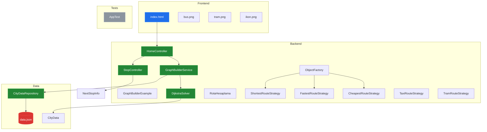
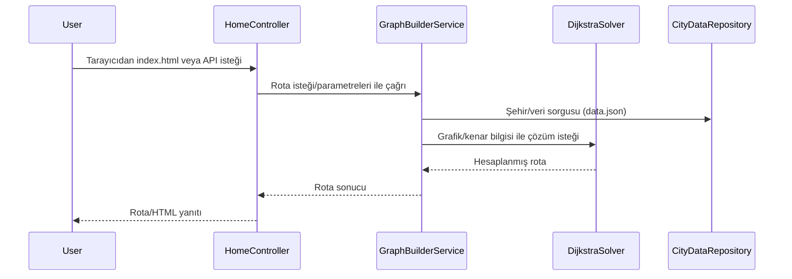

# Sistem Mimarisi: YusuffBulbul/Izmit_sehir_ici_ulasim

> Mimari analiz ve code review
>
> 2026-09-07 tarihinde Repo-to-Blueprint Architect tarafından otomatik oluşturuldu

# Türkçe Sürüm

## Proje Amacı
Bu depo şehir içi ulaşım rotalarıyla ilgili Java kaynak kodları içerir; kontrolörler (HomeController, StopController), rota/strateji sınıfları (ShortestRouteStrategy, TaxiRouteStrategy, TramRouteStrategy vb.), bir DijkstraSolver ve bir şehir veri deposu (CityDataRepository) barındırır (dosya listesi: src/main/java/com/example/...). Bu kanıtlar projenin kent içi ulaşım/rota hesaplama alanında olduğunu gösterir (örnek dosyalar: RotaHesaplama.java, DijkstraSolver.java, CityData.java).

## Teknik Yığın
- **Dil**: Java (dosya uzantıları .java, proje yapısı src/main/java)
- **Framework**: pom.xml dosyası mevcut; içerik sağlanmadığı için bağımlılık/çerçeve listesi kanıtta yok (pom.xml)
- **Temel Bağımlılıklar**: Sağlanan kanıtta pom.xml içeriği verilmedi — bağımlılık isimleri listelenemiyor
- **Altyapı**: (ilgili konfigürasyon dosyası kanıtı yok — satır atlandı)

## Mimari Plan

## İstek Akışı

## Kanıta Dayalı Riskler
1. Tüm uygulama sınıfları aynı paket altında toplanmış; katmanlı ayrım/ayrıştırma eksikliği sürdürmeyi zorlaştırabilir — kanıt: çok sayıda sınıf aynı dizinde src/main/java/com/example/ (ör. HomeController.java, GraphBuilderService.java, DijkstraSolver.java, CityDataRepository.java).
2. Test varlığı sınırlı görünüyor; yalnızca bir test sınıfı mevcut — kanıt: src/test/java/com/example/AppTest.java.
3. pom.xml dosyası depo kökünde bulunmasına rağmen sağlanan kanıtta içeriği yok; bağımlılıklar/çerçeveler doğrulanamıyor (kanıt: pom.xml listelenmiş ancak içeriği sağlanmamış).

## Code Review

### Öncelik Özeti
| ID | Öncelik | Kategori | Teknik Borç | Kanıt | Etki | Önerilen Aksiyon |
|---|---:|---|---|---|---|---|
| [ARC-01] | P1 | Mimari | Tek paket/monsolitik düzenleme; katman ayrımı zayıf | src/main/java/com/example/HomeController.java, src/main/java/com/example/GraphBuilderService.java, src/main/java/com/example/DijkstraSolver.java, src/main/java/com/example/CityDataRepository.java | Bakım zorluğu, modüler geliştirme ve bağımsız test zorlaşır | Paketlere göre katmanlandırma (controller, service, repository, model, algo). Sınıf sorumluluklarını ayırarak modüler paketleme yapın. |
| [STA-01] | P2 | Statik Analiz | Yetersiz test gözlemi (tek test sınıfı) | src/test/java/com/example/AppTest.java (tek test dosyası listelenmiş) | Düşük test kapsaması, regresyon riski | Unit/integration testleri ekleyin: Controller, GraphBuilderService, DijkstraSolver için JUnit testleri; mock CityDataRepository ile sınama. |
| [ARC-02] | P2 | Mimari | Statik frontend kaynakları backend kaynaklarıyla aynı repoda; sınırlar bulanık | src/main/resources/static/index.html ve src/main/java/com/example/HomeController.java | Frontend-backend bağımlılığı, dağıtım/örn. ayrı deploy zorluğu | Frontend ayrı bir proje veya net API yüzeyi tasarlayın; HomeController statik dosya servisini API'den ayırın. |
| [TEC-01] | P3 | Teknoloji | pom.xml mevcut ancak içerik sağlanmadığı için bağımlılık ve yapı doğrulanamıyor | pom.xml (dosya listesinde mevcut) | Build/dokümantasyon belirsizliği; katkıda bulunanlar için kurulum belirsiz | pom.xml içeriğini depo ile paylaşın; README'ye build/çalıştırma talimatları ekleyin. Eğer özel eklentiler varsa pom.xml içinde açıkça belirtin. |

### Statik Analiz
- [P2] STA-01: src/test/java/com/example/AppTest.java — tek test dosyası gözlemleniyor; birim ve entegrasyon testleri eksik.

### Güvenlik
- Kanıta dayalı güvenlik borcu bulunamadı.

### Mimari
- [P1] ARC-01: src/main/java/com/example/* — Controller, Service, Repository, Model ve Algoritma sınıfları aynı paket altında; zayıf modüler sınırlar.
- [P2] ARC-02: src/main/resources/static/index.html ile HomeController.java aynı repoda barındırma; frontend-backend sorumluluklarının ayrılmaması dağıtım ve sürdürmede sorun yaratabilir.

### Teknoloji
- [P3] TEC-01: pom.xml kök dizinde listelenmiş ancak sağlanan kanıtta içeriği yok; bağımlılıklar/çerçeve detayları doğrulanamıyor (pom.xml).

Notlar:
- Tüm bulgular sadece depo dosya listesi ve dosya adlarına dayanarak yapılmıştır; içerik dosyaları (pom.xml, .java içerikleri) metinsel olarak sağlanmadığı için detaylı kod incelemesi yapılamamıştır. Her tavsiye verilen dosya yollarındaki gözlemlenen yapı/pattern'e dayanmaktadır.

---

## Depo İstatistikleri
| Metrik | Değer |
|---|---|
| Toplam Dosya | 42 |
| Toplam Dizin | 11 |
| Oluşturulma | 2026-09-07 |
| Kaynak | [YusuffBulbul/Izmit_sehir_ici_ulasim](https://github.com/YusuffBulbul/Izmit_sehir_ici_ulasim) |

---

*Repo-to-Blueprint Architect via n8n*
