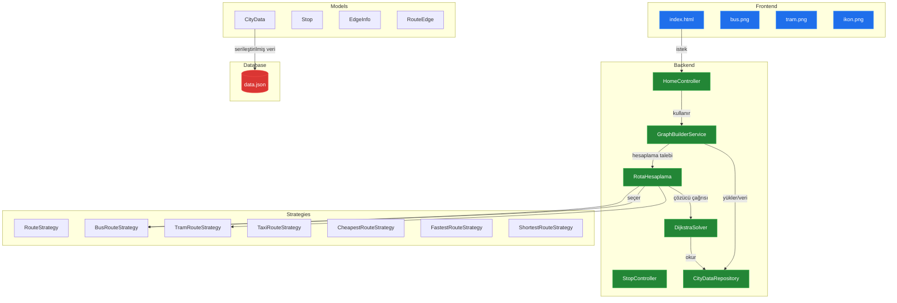
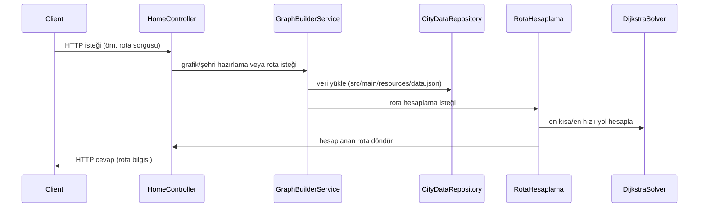

# Sistem Mimarisi: YusuffBulbul/Izmit_sehir_ici_ulasim

> Mimari analiz ve code review
>
> 2026-09-07 tarihinde Repo-to-Blueprint Architect tarafından otomatik oluşturuldu

# Türkçe Sürüm

## Proje Amacı
Bu depo, dosya adları ve paket yapısına göre İzmit şehir içi ulaşım için rota hesaplama ve grafik/hat modellleme sağlayan bir Java uygulamasıdır (ör. RotaHesaplama, BusRouteStrategy, TramRouteStrategy, DijkstraSolver, CityData, Stop, GraphBuilderService).

## Teknik Yığın
- **Dil**: Java (src/main/java/*.java, src/test/java/*.java)
- **Framework**: Sağlanan bağımlılık dosyası (pom.xml) içeriği verilmedi — proje düzeyinde kullanılacak web veya DI framework'ü pom.xml içeriği sağlanmadan belirlenemiyor.
- **Temel Bağımlılıklar**: pom.xml dosya adı mevcut; pom.xml içeriği sağlanmadığı için bağımlılık listesi sağlanamıyor.
- **Altyapı**: (Depoda altyapı konfigürasyon dosyası bulunmuyor; ör. Terraform, Dockerfile, .github/workflows yok)

## Mimari Plan

## İstek Akışı

## Kanıta Dayalı Riskler
1. Depoda konfigürasyon dosyası (application.properties veya application.yml) veya başka çevresel gizli yapılandırma dosyası yok: src/main/resources altında yalnızca data.json ve static/ görünüyor — bu, uygulama konfigürasyonunun nasıl sağlandığına dair kanıt eksikliği oluşturuyor (dosya ağacı: src/main/resources/data.json, src/main/resources/static/*).
2. Uygulama veri kaynağı olarak gömülü JSON dosyasına işaret ediyor: src/main/resources/data.json ve CityDataRepository.java, CityData.java gibi sınıfların varlığı veri tek dosyada tutuluyor olabileceğini gösteriyor — ölçeklenebilirlik ve güncelleme sınırlamaları riski.
3. Test kapsamı sınırlı görünüyor: yalnızca tek bir test dosyası var (src/test/java/com/example/AppTest.java) — servis katmanları, stratejiler ve hesaplayıcılar için kapsamlı birim testi kanıtı yok.

## Code Review

### Öncelik Özeti
| ID | Öncelik | Kategori | Teknik Borç | Kanıt | Etki | Önerilen Aksiyon |
|---|---:|---|---|---|---|---|
| SEC-01 | P1 | Security | Konfigürasyon/gizli yönetimi eksikliği | src/main/resources/ (sadece data.json ve static/ var; application.properties veya .yml yok) | Gizli/konfigürasyon yönetimi belirsiz, özellikle ödeme sınıfları için risk | application.properties veya environment-based config ekleyin; gizli bilgileri harici vault veya environment değişkenleriyle yönetin |
| ARC-01 | P1 | Architecture | Gömülü tek-dosya veri kaynağı | src/main/resources/data.json ve CityDataRepository.java | Veri güncelleme, ölçek ve eşzamanlı erişim sorunları | Veri kaynağını dış bir DB veya konfigüre edilebilir veri servisine taşıyın; CityDataRepository için soyutlama ekleyin |
| STA-01 | P2 | Static Analysis | Test kapsamı eksikliği | src/test/java/com/example/AppTest.java (tek test dosyası) | Regresyon tespiti zor, güvenilirlik düşer | Unit/integration test'leri ekleyin: RotaHesaplama, DijkstraSolver, Strategy sınıfları için testler |
| ARC-02 | P2 | Architecture | Kontroller/servislerin framework entegrasyon belirsizliği | HomeController.java, StopController.java, GraphBuilderService.java ve pom.xml (içeriği sağlanmadı) | Controller wiring ve lifecycle belirsiz; deployment/bootstrapping eksikliği | pom.xml içeriğini doğrulayın; kullanılan web/DI framework'ünü açıkça belirleyin ve örnek konfigürasyon ekleyin |
| STA-02 | P3 | Static Analysis | Strateji sınıfları tekrarı veya tutarsızlık riski | BusRouteStrategy.java, TramRouteStrategy.java, TaxiRouteStrategy.java, CheapestRouteStrategy.java, FastestRouteStrategy.java, ShortestRouteStrategy.java, RouteStrategy.java | Benzer kod parçaları çoğalabilir, bakım zorlaşır | Ortak davranış için base sınıf veya yardımcı (util) fonksiyonlar çıkarın; ortak testler yazın |
| TEC-01 | P3 | Technology | Statik kaynak yönetimi/optimizasyon eksikliği | src/main/resources/static/index.html, bus.png, tram.png, ikon.png | Büyük statik dosyalar, cache kontrolü veya sıkıştırma yoksa performans etkilenir | Statik varlıklar için optimize, sıkıştırma ve cache başlıkları ekleyin; versiyonlama düşünün |

### Statik Analiz
- [P2] STA-01: src/test/java/com/example/AppTest.java — yalnızca tek test dosyasının bulunması; önemli servis ve algoritma sınıfları (RotaHesaplama, DijkstraSolver, çeşitli Strategy sınıfları) için kapsamlı birim/integrasyon testi eksik.
- [P3] STA-02: BusRouteStrategy.java, TramRouteStrategy.java, TaxiRouteStrategy.java, CheapestRouteStrategy.java, FastestRouteStrategy.java, ShortestRouteStrategy.java, RouteStrategy.java — çok sayıda Strategy sınıfı bulunuyor; ortak kod tekrarının olması muhtemel, ortak soyutlama veya yardımcı fonksiyonlar değerlendirilmeli.

### Güvenlik
- [P1] SEC-01: src/main/resources/ — yalnızca data.json ve static/ görünüyor; application.properties/application.yml veya gizli/yönetim dosyası bulunmuyor. Ayrıca ödeme ile ilgili sınıflar mevcut: KrediKarti.java, KentKart.java, Nakit.java, OdemeYontemi.java, Indirim.java — depo içinde konfigürasyon ve gizli yönetimi için açık bir kanıt yok. Ödeme veri işleme/şifreleme/gizli yönetimi ile ilgili bir konfigürasyon kanıtı verilmemiş.

### Mimari
- [P1] ARC-01: src/main/resources/data.json ve CityDataRepository.java — veri kaynağı olarak gömülü JSON dosyası kullanımı tespit ediliyor; bu mimari olarak ölçeklenebilirlik, eşzamanlı güncelleme ve veri yönetimi problemleri yaratabilir.
- [P2] ARC-02: HomeController.java, StopController.java, GraphBuilderService.java ve pom.xml varlığı — ancak pom.xml içeriği sağlanmadığı için hangi web/DI framework'ünün (ör. Spring Boot) kullanıldığı doğrulanamıyor; controller'ların nasıl başlatıldığı/dependency injection ile nasıl bağlandığı net değil.

### Teknoloji
- [P3] TEC-01: src/main/resources/static/index.html, bus.png, tram.png, ikon.png — statik varlıkların optimize edildiğine dair kanıt yok (ör. minify, cache kontrolü, sürümleme).
- [P3] (bilgilendirici) pom.xml dosyası repo kökünde mevcut fakat bağlı bağımlılıkların içeriği bu inceleme kanıt setinde verilmedi — bu durum üçüncü taraf kütüphaneleri ve framework'ü netleştirmeyi engelliyor.

Not: Tüm bulgular yalnızca depo dosya ağacı ve dosya adlarına dayandırılmıştır (ör. src/main/java/com/example/*.java, src/main/resources/*, src/test/java/com/example/AppTest.java, pom.xml). İçerik detayları (pom.xml içeriği veya Java sınıf kodları) verilmediği için bazı doğrulamalar yapılamamıştır; önerilen aksiyonlar, belirtilen dosya/pattern'lerde yapılacak değişiklikleri hedeflemektedir.

---

## Depo İstatistikleri
| Metrik | Değer |
|---|---|
| Toplam Dosya | 42 |
| Toplam Dizin | 11 |
| Oluşturulma | 2026-09-07 |
| Kaynak | [YusuffBulbul/Izmit_sehir_ici_ulasim](https://github.com/YusuffBulbul/Izmit_sehir_ici_ulasim) |

---

*Repo-to-Blueprint Architect via n8n*
