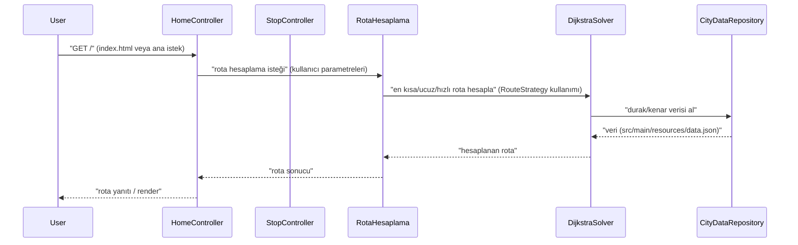

# Sistem Mimarisi: YusuffBulbul/Izmit_sehir_ici_ulasim

> Mimari analiz ve code review
>
> 2026-09-07 tarihinde Repo-to-Blueprint Architect tarafından otomatik oluşturuldu

# Türkçe Sürüm

## Proje Amacı
Bu depo, şehir içi ulaşım için rota hesaplama ve durak/hat verilerini yöneten bir Java uygulaması olduğunu gösteriyor; kanıt: RotaHesaplama, DijkstraSolver, çeşitli RouteStrategy* sınıfları ve src/main/resources/data.json dosyası.

## Teknik Yığın
- **Dil**: Java (src/main/java/*.java dosya uzantıları)
- **Framework**: Belirlenemiyor (pom.xml proje kökünde mevcut; içerik/dependencies sağlanmadı)
- **Temel Bağımlılıklar**: Sağlanan kanıt dosyalarında bağımlılık listesi yok (pom.xml mevcut fakat içeriği sağlanmadı)
- **Altyapı**: (ilgili konfigürasyon dosyası yok — bu satır atlandı)

## Mimari Plan

```mermaid
flowchart TD
  subgraph Frontend
    FE["Static UI index.html"]
    FE_IMG1["bus.png"]
    FE_IMG2["tram.png"]
    FE_IMG3["ikon.png"]
  end
  subgraph Backend
    BE1["HomeController"]
    BE2["StopController"]
    BE3["RotaHesaplama"]
    BE4["DijkstraSolver"]
    BE5["CityDataRepository"]
    BE6["GraphBuilderService"]
    BE7["ManualGraph"]
    BE8["RouteStrategy"]
  end
  subgraph Data
    DB1[("data.json")]
  end
  FE --> BE1
  BE1 --> BE3
  BE3 --> BE4
  BE4 --> BE5
  BE6 --> DB1
  BE7 --> BE6
  BE8 --> BE3

  end
  style FE fill:#1f6feb,stroke:#58a6ff,color:#fff
  style FE_IMG1 fill:#1f6feb,stroke:#58a6ff,color:#fff
  style FE_IMG2 fill:#1f6feb,stroke:#58a6ff,color:#fff
  style FE_IMG3 fill:#1f6feb,stroke:#58a6ff,color:#fff
  style BE1 fill:#238636,stroke:#3fb950,color:#fff
  style BE2 fill:#238636,stroke:#3fb950,color:#fff
  style BE3 fill:#238636,stroke:#3fb950,color:#fff
  style BE4 fill:#238636,stroke:#3fb950,color:#fff
  style BE5 fill:#238636,stroke:#3fb950,color:#fff
  style BE6 fill:#238636,stroke:#3fb950,color:#fff
  style BE7 fill:#238636,stroke:#3fb950,color:#fff
  style BE8 fill:#238636,stroke:#3fb950,color:#fff
  style DB1 fill:#da3633,stroke:#f85149,color:#fff

```

## İstek Akışı



## Kanıta Dayalı Riskler
1. Tüm sınıfların tek paket altında toplanması: src/main/java/com/example/ içinde çok sayıda sınıf bulunuyor (ör. HomeController, RotaHesaplama, DijkstraSolver, RouteStrategy ve birçok strateji impl.) — bu, modülerlik ve sorumluluk ayrımını zorlaştırabilir.
2. Test kapsamının sınırlı olduğuna dair kanıt: tek bir test dosyası mevcut (src/test/java/com/example/AppTest.java) — kapsamın yetersiz olma ihtimali var.
3. Uygulama verisinin kaynak kod içinde tek bir JSON dosyasında tutulması: src/main/resources/data.json — sabitlenmiş/harici verinin doğrudan paketlenmesi operasyonel veya gizlilik riski oluşturabilir.

## Code Review

### Öncelik Özeti
| ID | Öncelik | Kategori | Teknik Borç | Kanıt | Etki | Önerilen Aksiyon |
|---|---:|---|---|---|---|---|
| ARC-01 | P2 | Mimari | Tek paket (com.example) altında yoğun sınıf kümesi | src/main/java/com/example/ (çok sayıda sınıf: App.java, RotaHesaplama.java, DijkstraSolver.java, RouteStrategy*.java vb.) | Sınıflar arasında yüksek bağlılık ve zayıf modülerlik; bakım zorlaşır | Paketi mantıksal alt paketlere ayırın (controller, service, model, strategy, repository). Küçük adımlarla yeniden paketleme yapın. |
| STA-01 | P2 | Statik Analiz | Test kapsamı sınırlı — yalnızca AppTest.java | src/test/java/com/example/AppTest.java (tek test dosyası listesi) | Regresyon yakalanma şansı düşük; kalite güvencesi zayıf | Unit test sayısını artırın; RotaHesaplama, DijkstraSolver ve RouteStrategy sınıfları için izole testler ekleyin. |
| ARC-02 | P3 | Mimari | Hem statik frontend dosyaları hem controller sınıfları var — UI/servis sınırı belirsiz | src/main/resources/static/index.html ve src/main/java/com/example/HomeController.java, StopController.java | UI ve server tarafı sorumluluk çakışması; deployment/serving kararları karışık olabilir | UI ile backend ayrımını netleştirin. Eğer SPA ise backend API'lerini açıkça REST API olarak sunun; aksi halde server-side rendering yaklaşımını düzenleyin. |
| STA-02 | P3 | Statik Analiz | Benzer/çakışan grafik-yapı kurma kodu gözüktüğü kanıtı | src/main/java/com/example/ManualGraph.java, GraphBuilderService.java, GraphBuilderExample.java | Kod tekrarı veya belirsiz sorumluluk — bakım maliyeti | Graph inşa mantığını tek bir sorumluluğa toplayın; örnek ve servis ayrımı yapılmışsa dokümante edin ve tekrar eden kodu soyutlayın. |
| SEC-01 | P3 | Güvenlik | Uygulama verisi kaynak içinde sabitlenmiş (data.json) | src/main/resources/data.json | Hassas veri veya büyük veri setleri repo ile dağıtılabilir; güncelleme/deployment zorluğu | Sensitive bilgiler içeriyorsa repo dışında tutun; veri için versiyonlanmış ve erişimli bir veri kaynağı veya konfigürasyon yöntemi kullanın. |
| TEC-01 | P3 | Teknoloji | Bağımlılık/çerçeve belirtilmemiş (pom.xml içerikleri sağlanmamış) — proje yapılandırması net değil | pom.xml (dosya mevcut; içerik sağlanmadı) | İnşa/çalıştırma adımları ve gerekli kütüphaneler bilinmiyor; geliştirici deneyimi olumsuz | pom.xml içeriğini paylaşın veya README ekleyin; proje derleme talimatlarını ve gerekli Maven/Java sürümünü belirtin. |

### Statik Analiz
- [P2] STA-01: src/test/java/com/example/AppTest.java — Test var ancak tek dosya; RotaHesaplama, DijkstraSolver, RouteStrategy sınıfları için birim test yokluğu tespit edilebiliyor (test kapsamının yetersiz olduğuna işaret eder).
- [P3] STA-02: src/main/java/com/example/ManualGraph.java ve src/main/java/com/example/GraphBuilderService.java, src/main/java/com/example/GraphBuilderExample.java — benzer sorumluluklar/örnek kod birikimi; kod tekrarı veya belirsiz sınırlar olabilir.

### Güvenlik
- [P3] SEC-01: src/main/resources/data.json — uygulama verisinin repository içinde sabitlenmesi; eğer bu dosya hassas bilgi içeriyorsa risk oluşturabilir. (Dosya içeriği burada gösterilmedi; varlığı kanıtlanmıştır.)

### Mimari
- [P2] ARC-01: src/main/java/com/example/ içinde tüm sınıfların tek paket altında toplanması (App.java, HomeController.java, StopController.java, RotaHesaplama.java, DijkstraSolver.java, RouteStrategy*, BusRouteStrategy.java, TramRouteStrategy.java, TaxiRouteStrategy.java vb.) — sorumluluk ayrımı ve modülerlik zayıf.
- [P3] ARC-02: Hem src/main/resources/static/index.html (ve resimler) hem HomeController/StopController sınıflarının bulunması — UI ve API sorumluluklarının ayrımı net değil.

### Teknoloji
- [P3] TEC-01: pom.xml proje kökünde bulunuyor ancak sağlanan kanıtlarda içerik (bağımlılıklar, build pluginleri, Java versiyonu) verilmedi — proje derleme/çalıştırma için eksik bilgi. (pom.xml var: proje kökünde)

(Not: Yukarıdaki tüm tespitler yalnızca repository dosya ağacı ve dosya adlarına dayanılarak yapılmıştır; dosya içerikleri sağlanmamıştır veya sınırlı şekilde sağlanmıştır.)

---

## Depo İstatistikleri
| Metrik | Değer |
|---|---|
| Toplam Dosya | 41 |
| Toplam Dizin | 11 |
| Oluşturulma | 2026-09-07 |
| Kaynak | [YusuffBulbul/Izmit_sehir_ici_ulasim](https://github.com/YusuffBulbul/Izmit_sehir_ici_ulasim) |

---

*Repo-to-Blueprint Architect via n8n*
