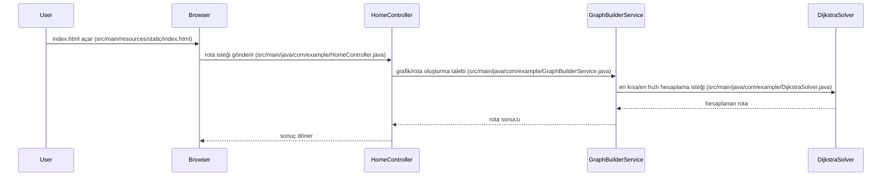

# Sistem Mimarisi: YusuffBulbul/Izmit_sehir_ici_ulasim

> Mimari analiz ve code review
>
> 2026-09-07 tarihinde Repo-to-Blueprint Architect tarafından otomatik oluşturuldu

# Türkçe Sürüm

## Proje Amacı
Bu depo, şehir içi ulaşım rotalarını hesaplamaya yönelik Java tabanlı bir uygulama içeriyor; dosya isimleri ve sınıf yapısı (ör. DijkstraSolver, BusRouteStrategy, TramRouteStrategy, GraphBuilderService, data.json) rota hesaplama ve toplu taşıma odaklıdır.

## Teknik Yığın
- **Dil**: Java (dosya uzantıları .java ve proje kökünde pom.xml var)
- **Framework**: Belirlenemiyor — dependency içeriği pom.xml dosya içeriği sağlanmadığından framework bilgisi çıkartılamadı
- **Temel Bağımlılıklar**: pom.xml içeriği sağlanmadığından listelenemiyor
- **Altyapı**: (ilgili konfigürasyon dosyası yok)

## Mimari Plan

```mermaid
flowchart TD
subgraph BACKEND ["Backend"]
APP["App"]
HOME["HomeController"]
STOP["StopController"]
GRAPH["GraphBuilderService"]
DIJK["DijkstraSolver"]
STRATBUS["BusRouteStrategy"]
STRATTRAM["TramRouteStrategy"]
STRATTAXI["TaxiRouteStrategy"]
STRATOTHER["ShortestRouteStrategy / FastestRouteStrategy / CheapestRouteStrategy"]
end
subgraph DATA ["Data"]
DATA[("data.json")]
end
subgraph FRONTEND ["Frontend"]
INDEX["index.html"]
BUSIMG["bus.png"]
TRAMIMG["tram.png"]
ICON["ikon.png"]
end
INDEX --> HOME
HOME --> GRAPH
GRAPH --> DIJK
DIJK --> STRATBUS
DIJK --> STRATTRAM
DIJK --> STRATTAXI
GRAPH --> DATA
style INDEX fill:#1f6feb,stroke:#58a6ff,color:#fff
style BUSIMG fill:#1f6feb,stroke:#58a6ff,color:#fff
style TRAMIMG fill:#1f6feb,stroke:#58a6ff,color:#fff
style ICON fill:#1f6feb,stroke:#58a6ff,color:#fff
style APP fill:#238636,stroke:#3fb950,color:#fff
style HOME fill:#238636,stroke:#3fb950,color:#fff
style STOP fill:#238636,stroke:#3fb950,color:#fff
style GRAPH fill:#238636,stroke:#3fb950,color:#fff
style DIJK fill:#238636,stroke:#3fb950,color:#fff
style STRATBUS fill:#238636,stroke:#3fb950,color:#fff
style STRATTRAM fill:#238636,stroke:#3fb950,color:#fff
style STRATTAXI fill:#238636,stroke:#3fb950,color:#fff
style STRATOTHER fill:#238636,stroke:#3fb950,color:#fff
style DATA fill:#da3633,stroke:#f85149,color:#fff

```

## İstek Akışı



## Kanıta Dayalı Riskler
1. Uygulamada HomeController ve StopController sınıfları var ancak depo içinde kimlik doğrulama/yetkilendirme ile ilgili sınıf veya konfigürasyon görünmüyor — (src/main/java/com/example/HomeController.java, src/main/java/com/example/StopController.java).
2. Test kapsamı zayıf: sadece tek bir test sınıfı var (src/test/java/com/example/AppTest.java), çekirdek iş mantığı sınıfları (ör. DijkstraSolver, GraphBuilderService, RouteStrategy implementasyonları) için test kanıtı yok.
3. Veri kaynağı olarak sabit JSON kullanımı (src/main/resources/data.json) uygulamanın gerçek zamanlı veri veya veritabanı entegrasyonundan yoksun olduğunu gösteriyor; bu durum veri güncelleme ve ölçeklenebilirlik gereksinimleri için risk oluşturabilir.

## Code Review

### Öncelik Özeti
| ID | Öncelik | Kategori | Teknik Borç | Kanıt | Etki | Önerilen Aksiyon |
|---|---:|---|---|---|---|---|
| SEC-01 | P1 | Security | Yetkilendirme/kimlik doğrulama eksikliği | src/main/java/com/example/HomeController.java; src/main/java/com/example/StopController.java — depo içinde auth/security sınıfı bulunmuyor | Yetkisiz erişim riski; prod ortamda veri ve işlemler korunmayabilir | Authentication/authorization mekanizması ekleyin (ör. güvenlik filtresi, token doğrulama) ve controller girişlerini doğrulayın |
| STA-02 | P2 | Static Analysis | Yetersiz test kapsamı | src/test/java/com/example/AppTest.java — tek test sınıfı bulunuyor; çekirdek sınıflar için test yok | Regresyon riski, refactor sırasında hata ihtimali | DijkstraSolver, GraphBuilderService, RouteStrategy implementasyonları için birim testleri ekleyin |
| ARC-03 | P2 | Architecture | Sabit JSON veri kaynağı kullanımı | src/main/resources/data.json ve src/main/java/com/example/GraphBuilderService.java | Veri güncelleme, ölçeklenebilirlik ve entegrasyon sınırlamaları | Veri erişimini soyutlayacak bir repository arayüzü ekleyin; data.json için adaptör/loader oluşturun ve gerçek DB entegrasyonu için genişletin |
| TEC-04 | P3 | Technology | Statik frontend dosyaları pipeline eksikliği | src/main/resources/static/index.html, bus.png, tram.png, ikon.png | Frontend asset optimizasyonu ve sürüm yönetimi eksik olabilir | Frontend build/asset pipeline veya basit minify/prod optimizasyonu ekleyin; asset yönetimini dökümante edin |
| STA-05 | P3 | Static Analysis | İsimlendirmede dil karışıklığı (tutarlılık) | src/main/java/com/example/ içinde Arac.java, Yolcu.java, KentKart.java, KrediKarti.java vs. HomeController.java, StopController.java | Kod okunabilirliğinde ve ekip içi anlaşılırlıkta küçük sürtüşmeler | Kod tabanında naming konvansiyonu belirleyin (ör. tüm sınıf adları için İngilizce veya Türkçe tercih edin) ve dosya adlarını eşleştirin |

### Statik Analiz
- [P2] STA-02 — src/test/java/com/example/AppTest.java: Depoda yalnızca bir test sınıfı var; çekirdek mantığın (DijkstraSolver, GraphBuilderService, RouteStrategy'ler) otomatik testleri eksik.
- [P3] STA-05 — src/main/java/com/example/: Sınıf isimlendirmelerinde Türkçe/İngilizce karışımı (ör. Arac.java, Yolcu.java vs HomeController.java) var; kod standardizasyonu eksik.

### Güvenlik
- [P1] SEC-01 — src/main/java/com/example/HomeController.java; src/main/java/com/example/StopController.java: Depoda kimlik doğrulama/yetkilendirme/ güvenlik sınıflarına dair dosya veya konfigürasyon kanıtı yok; erişim kontrolü mekanizması eksik görünmekte.

### Mimari
- [P2] ARC-03 — src/main/resources/data.json ve src/main/java/com/example/GraphBuilderService.java: Sabit JSON dosyası veri kaynağı olarak kullanılıyor; veri erişiminin soyutlanması ve dışsal veri kaynağı entegrasyonu için yapı eksik.
- No evidence-backed technical debt found (diğer mimari alt-kategoriler için başka kanıt yok).

### Teknoloji
- [P3] TEC-04 — src/main/resources/static/*: Statik frontend dosyaları depo içinde mevcut; frontend build/asset pipeline veya paketleme kanıtı yok.
- No evidence-backed technical debt found (ör. eksik pom.xml bağımlılık iddiası yapılamaz çünkü pom.xml içeriği sağlanmadı).

Notlar / Kanıt Referansları
- Projedeki ana giriş/organizasyon dosyaları: src/main/java/com/example/App.java, HomeController.java, StopController.java, GraphBuilderService.java, DijkstraSolver.java, çeşitli RouteStrategy sınıfları (ör. BusRouteStrategy.java, TramRouteStrategy.java, TaxiRouteStrategy.java).
- Statik içerik ve veri: src/main/resources/static/index.html, bus.png, tram.png, ikon.png; src/main/resources/data.json.
- Test kanıtı: src/test/java/com/example/AppTest.java.
- Bağımlılıklar ve framework'ler pom.xml aracılığıyla tanımlanır ancak pom.xml içeriği sağlanmadığı için bağımlılık listesi raporda yer almamıştır.

---

## Depo İstatistikleri
| Metrik | Değer |
|---|---|
| Toplam Dosya | 42 |
| Toplam Dizin | 11 |
| Oluşturulma | 2026-09-07 |
| Kaynak | [YusuffBulbul/Izmit_sehir_ici_ulasim](https://github.com/YusuffBulbul/Izmit_sehir_ici_ulasim) |

---

*Repo-to-Blueprint Architect via n8n*
