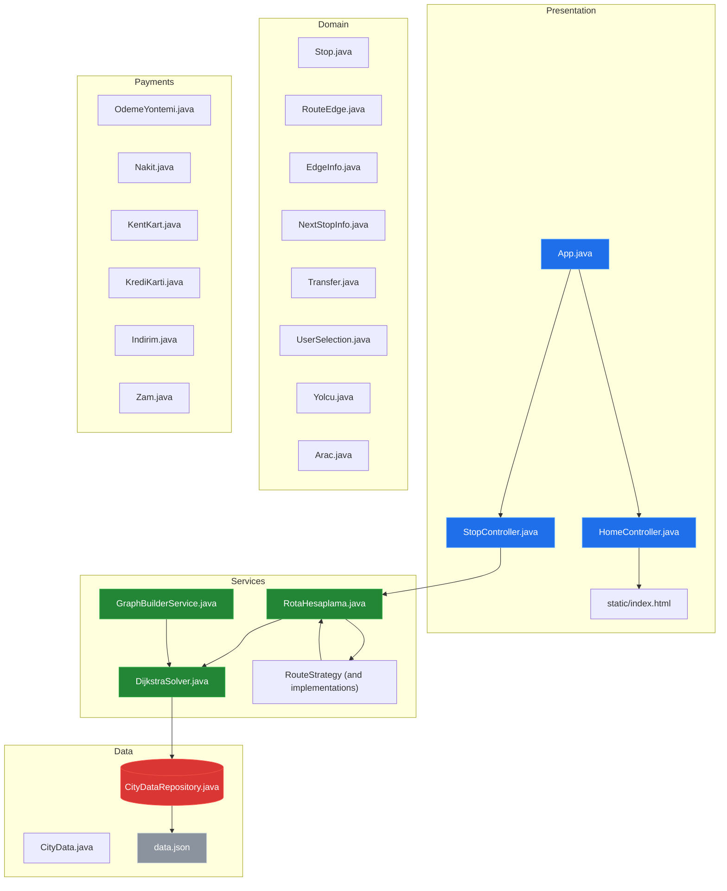
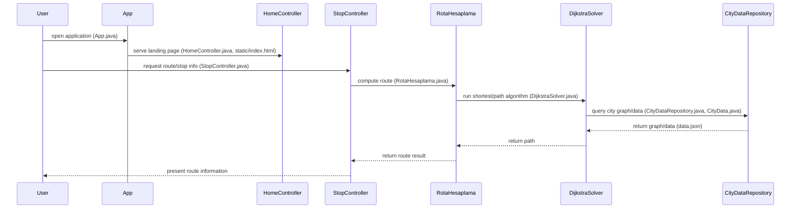
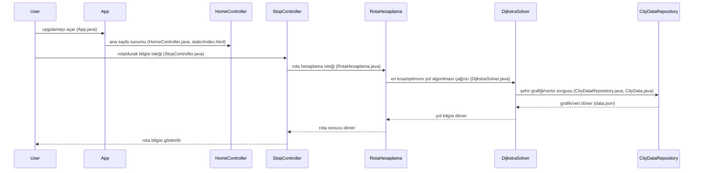

# System Blueprint / Sistem Mimarisi: YusuffBulbul/Izmit_sehir_ici_ulasim

> Architecture and code review analysis
>
> Auto-generated / Otomatik oluşturuldu: 2026-09-07

# English Version

## Project Purpose
This repository contains a Java-based application for city intra-transport/route calculations and related domain objects, as evidenced by classes such as RotaHesaplama.java, DijkstraSolver.java, various RouteStrategy implementations, and payment/vehicle/domain model classes under src/main/java/com/example.

## Technical Stack
- **Language**: Java (src/main/java, src/test/java)
- **Framework**: No framework explicitly identifiable from dependency files in the provided evidence (pom.xml exists but its contents were not provided).
- **Key Dependencies**: No dependency list available in the provided evidence (pom.xml present but dependency contents not shown).
- **Infrastructure**: (none identified in repository evidence)

## Architecture Blueprint

## Request Flow

## Evidence-Based Risks
1. Limited test coverage: only a single test file is present at src/test/java/com/example/AppTest.java, suggesting many core classes (RotaHesaplama.java, DijkstraSolver.java, RouteStrategy implementations) lack unit tests in the repository evidence.
2. Multiple route strategy implementations colocated in the same package (ShortestRouteStrategy.java, FastestRouteStrategy.java, CheapestRouteStrategy.java, TaxiRouteStrategy.java, TramRouteStrategy.java, BusRouteStrategy.java alongside RouteStrategy.java) can increase maintenance and duplicate logic without an explicit central registration mechanism visible in the evidence.
3. Presence of payment-related classes (OdemeYontemi.java, KrediKarti.java, KentKart.java, Nakit.java) with no accompanying evidence of security controls, encryption, or storage patterns in the repository evidence.

## Code Review

### Priority Summary
| ID | Priority | Category | Technical Debt | Evidence | Impact | Recommended Action |
|---|---:|---|---|---|---|---|
| STA-01 | P1 | Static Analysis | Limited automated tests / low coverage | src/test/java/com/example/AppTest.java (only test file) | Risk of regressions, low confidence for changes | Add unit tests targeting RotaHesaplama.java, DijkstraSolver.java, RouteStrategy implementations, and controllers under src/test/java |
| ARC-01 | P2 | Architecture | Multiple concrete strategy classes may duplicate logic and increase maintenance | src/main/java/com/example/RouteStrategy.java; src/main/java/com/example/ShortestRouteStrategy.java; src/main/java/com/example/FastestRouteStrategy.java; src/main/java/com/example/CheapestRouteStrategy.java; src/main/java/com/example/TaxiRouteStrategy.java; src/main/java/com/example/TramRouteStrategy.java; src/main/java/com/example/BusRouteStrategy.java | Harder to add/modify routing behavior; potential duplicated code | Review and centralize common logic, document registration/invocation of strategies; add tests per strategy |
| ARC-02 | P2 | Architecture | Flat package organization for domain, service, and payment classes reduces separation of concerns | src/main/java/com/example/* (e.g., Stop.java, RouteEdge.java, DijkstraSolver.java, OdemeYontemi.java, KrediKarti.java) | Reduced modularity, harder to navigate and enforce boundaries | Introduce packages (e.g., com.example.domain, com.example.service, com.example.payment) and move related classes accordingly |
| SEC-01 | P2 | Security | Payment-related classes present without visible security controls in repo evidence | src/main/java/com/example/OdemeYontemi.java; src/main/java/com/example/KrediKarti.java; src/main/java/com/example/KentKart.java; src/main/java/com/example/Nakit.java | Potential for improper handling of sensitive payment data if not secured | Ensure payment data is encrypted in transit/storage; add documentation and tests for secure handling; review code for PCI requirements (implementations not visible in evidence) |
| TEC-01 | P3 | Technology | Build/dependency details not available in evidence snapshot (pom.xml present but contents not shown) | pom.xml (file present; dependency contents not provided) | Hard to verify frameworks and transitive dependencies from provided evidence | Ensure pom.xml documents framework and dependencies; include a project README that lists build/test commands |
| TEC-02 | P3 | Technology | Static web resources present but no explicit web framework evidence in the dependency files provided | src/main/resources/static/index.html; src/main/resources/static/*.png; HomeController.java; StopController.java | Unclear how static content is served/configured from the provided evidence | Document web framework and resource handling in pom.xml or README; add configuration files if required by framework |

### Static Analysis
- [P1] STA-01: src/test/java/com/example/AppTest.java is the only test file present — evidence of limited automated test coverage for core computational components (RotaHesaplama.java, DijkstraSolver.java, RouteStrategy implementations).

### Security
- [P2] SEC-01: Payment classes exist (src/main/java/com/example/OdemeYontemi.java; src/main/java/com/example/KrediKarti.java; src/main/java/com/example/KentKart.java; src/main/java/com/example/Nakit.java) with no repository evidence of secure storage, encryption libraries, or secrets management configuration.

### Architecture
- [P2] ARC-01: Multiple strategy implementation files (src/main/java/com/example/ShortestRouteStrategy.java; FastestRouteStrategy.java; CheapestRouteStrategy.java; TaxiRouteStrategy.java; TramRouteStrategy.java; BusRouteStrategy.java; and src/main/java/com/example/RouteStrategy.java) indicate a Strategy pattern usage; repository evidence does not show a central strategy registry or how strategies are composed, which may cause duplication.
- [P2] ARC-02: Many domain, service, and payment classes are colocated under src/main/java/com/example (e.g., Stop.java, RouteEdge.java, DijkstraSolver.java, OdemeYontemi.java), suggesting limited package-level layering.

### Technology
- [P3] TEC-01: pom.xml exists at repository root but dependency contents are not part of the provided evidence; no explicit list of libraries can be cited from the evidence.
- [P3] TEC-02: Static assets present under src/main/resources/static (index.html, tram.png, bus.png, ikon.png) alongside controller classes (HomeController.java, StopController.java), but no explicit framework or web resource configuration visible in the provided evidence.

---

# Türkçe Sürüm

## Proje Amacı
Bu depo, şehir içi ulaşım ve rota hesaplamasıyla ilgili Java tabanlı bir uygulama içerir; bunu RotaHesaplama.java, DijkstraSolver.java, çeşitli RouteStrategy implementasyonları ve ödeme/araç/doman sınıfları (src/main/java/com/example) dosya adları desteklemektedir.

## Teknik Yığın
- **Dil**: Java (src/main/java, src/test/java)
- **Framework**: Sağlanan bağımlılık dosyalarında açıkça tespit edilebilen bir framework yok (pom.xml mevcut ancak içeriği sağlanmadı).
- **Temel Bağımlılıklar**: Sağlanan kanıtlarda bağımlılık listesi yok (pom.xml dosyası mevcut fakat içerikleri gösterilmedi).
- **Altyapı**: (depoda kanıt yok)

## Mimari Plan

## İstek Akışı

## Kanıta Dayalı Riskler
1. Sınırlı test kapsamı: src/test/java/com/example/AppTest.java dosyası tek test dosyası olarak mevcut; çekirdek sınıflar (RotaHesaplama.java, DijkstraSolver.java, RouteStrategy implementasyonları) için birim testleri eksik olabilir.
2. Aynı pakette birçok route strategy implementasyonu (ShortestRouteStrategy.java, FastestRouteStrategy.java, CheapestRouteStrategy.java, TaxiRouteStrategy.java, TramRouteStrategy.java, BusRouteStrategy.java ve RouteStrategy.java) bulunması, kanıtlarda merkezi bir kayıt/kompozisyon mekanizması görünmediğinden bakım yükünü artırabilir.
3. Ödeme ile ilgili sınıflar (OdemeYontemi.java, KrediKarti.java, KentKart.java, Nakit.java) mevcut ancak depoda güvenlik kontrolleri, şifreleme veya saklama yaklaşımına dair kanıt bulunmamaktadır.

## Code Review

### Öncelik Özeti
| ID | Öncelik | Kategori | Teknik Borç | Kanıt | Etki | Önerilen Aksiyon |
|---|---:|---|---|---|---|---|
| STA-01 | P1 | Statik Analiz | Sınırlı otomatik test / düşük kapsama | src/test/java/com/example/AppTest.java (tek test dosyası) | Regresyon riski, değişikliklerde düşük güven | RotaHesaplama.java, DijkstraSolver.java, RouteStrategy implementasyonları ve controller'lar için src/test/java altında birim testleri ekleyin |
| ARC-01 | P2 | Mimari | Çok sayıda somut strategy sınıfı mantık tekrarı / bakım yükü oluşturabilir | src/main/java/com/example/RouteStrategy.java; src/main/java/com/example/ShortestRouteStrategy.java; src/main/java/com/example/FastestRouteStrategy.java; src/main/java/com/example/CheapestRouteStrategy.java; src/main/java/com/example/TaxiRouteStrategy.java; src/main/java/com/example/TramRouteStrategy.java; src/main/java/com/example/BusRouteStrategy.java | Rota davranışını değiştirmek veya genişletmek zorlaşabilir; kod tekrar potansiyeli | Ortak mantığı merkezileştirin, strategy kaydı/dinamik seçimi belgeleyin ve her strategy için test ekleyin |
| ARC-02 | P2 | Mimari | Domain, servis ve ödeme sınıflarının aynı pakette toplanması sınırları belirsizleştirir | src/main/java/com/example/* (ör. Stop.java, RouteEdge.java, DijkstraSolver.java, OdemeYontemi.java) | Modülerlik azalır, sınırlar ve sorumluluklar zor uygulanır | com.example.domain, com.example.service, com.example.payment gibi paketler oluşturup ilgili sınıfları taşıyın |
| SEC-01 | P2 | Güvenlik | Ödeme sınıfları depo kanıtında güvenlik kontrolleri olmadan yer alıyor | src/main/java/com/example/OdemeYontemi.java; src/main/java/com/example/KrediKarti.java; src/main/java/com/example/KentKart.java; src/main/java/com/example/Nakit.java | Hassas ödeme verilerinin yanlış işlenme riski | Ödeme verilerini iletimde ve depolamada şifreleyin; güvenli saklama/pratiklerini belgeleyin; kodu PCI gereksinimlerine göre gözden geçirin (implementasyon içerikleri kanıtta yok) |
| TEC-01 | P3 | Teknoloji | pom.xml kök dizininde ancak bağımlılık içerikleri sağlanmadı | pom.xml (dosya mevcut; bağımlılıklar sağlanmadı) | Hangi kütüphane/framework'lerin kullanıldığı belli değil | pom.xml içinde bağımlılıkların ve build talimatlarının yer aldığından emin olun; README'ye build/test komutlarını ekleyin |
| TEC-02 | P3 | Teknoloji | Kaynaklar src/main/resources/static altında; ancak depoda kullanılan web framework'üne dair açık kanıt yok | src/main/resources/static/index.html; src/main/resources/static/*.png; HomeController.java; StopController.java | Statik içeriğin framework ile nasıl servis edildiği belirsiz | Web frameworkü ve statik kaynak konfigürasyonunu pom.xml veya README'de belgeleyin; gerekiyorsa konfigürasyon dosyalarını ekleyin |

### Statik Analiz
- [P1] STA-01: src/test/java/com/example/AppTest.java tek test dosyasıdır — çekirdek hesaplama bileşenleri (RotaHesaplama.java, DijkstraSolver.java, RouteStrategy implementasyonları) için birim testlerinin eksik olduğuna dair kanıt.

### Güvenlik
- [P2] SEC-01: Ödeme sınıfları mevcut (src/main/java/com/example/OdemeYontemi.java; src/main/java/com/example/KrediKarti.java; src/main/java/com/example/KentKart.java; src/main/java/com/example/Nakit.java) ancak depo kanıtında güvenli saklama, şifreleme veya gizli yönetimine dair dosya veya konfigürasyon tespit edilmedi.

### Mimari
- [P2] ARC-01: RouteStrategy ve çoklu implementasyon dosyaları (src/main/java/com/example/ShortestRouteStrategy.java; FastestRouteStrategy.java; CheapestRouteStrategy.java; TaxiRouteStrategy.java; TramRouteStrategy.java; BusRouteStrategy.java; RouteStrategy.java) Strategy pattern kullanımını gösterir; depoda stratejilerin nasıl kaydedildiği veya seçildiğine dair açık bir kanıt yok, bu da tekrar riskini artırır.
- [P2] ARC-02: Domain, servis ve ödeme sınıfları aynı paket altında toplanmış (src/main/java/com/example örneği: Stop.java, RouteEdge.java, DijkstraSolver.java, OdemeYontemi.java), paket düzeyi katmanlama eksikliği gösterir.

### Teknoloji
- [P3] TEC-01: pom.xml kök dizinde mevcuttur ancak sağlanan kanıtta bağımlılık içerikleri yer almamaktadır; bu nedenle kullanılacak kütüphaneler kanıttan çıkarılamadı.
- [P3] TEC-02: src/main/resources/static içinde index.html ve resimler (tram.png, bus.png, ikon.png) var; controller sınıfları (HomeController.java, StopController.java) mevcut ancak hangi framework ile servis edildiği/konfigüre edildiği kanıtta net değil.

---

## Repository Stats / Depo İstatistikleri
| Metric / Metrik | Value / Değer |
|---|---|
| Total Files / Toplam Dosya | 42 |
| Total Directories / Toplam Dizin | 11 |
| Generated / Oluşturulma | 2026-09-07 |
| Source / Kaynak | [YusuffBulbul/Izmit_sehir_ici_ulasim](https://github.com/YusuffBulbul/Izmit_sehir_ici_ulasim) |

---

*Repo-to-Blueprint Architect via n8n*
