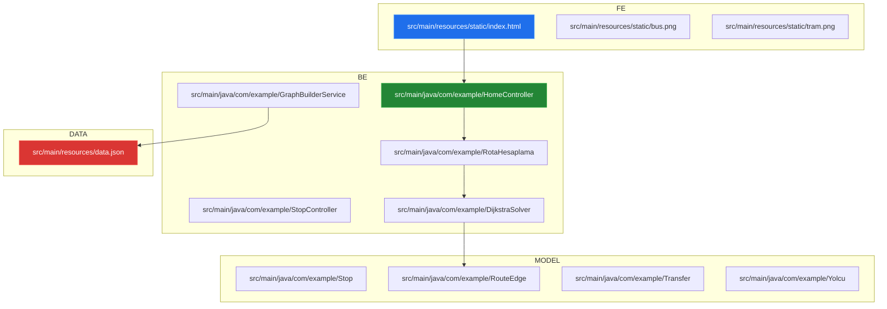
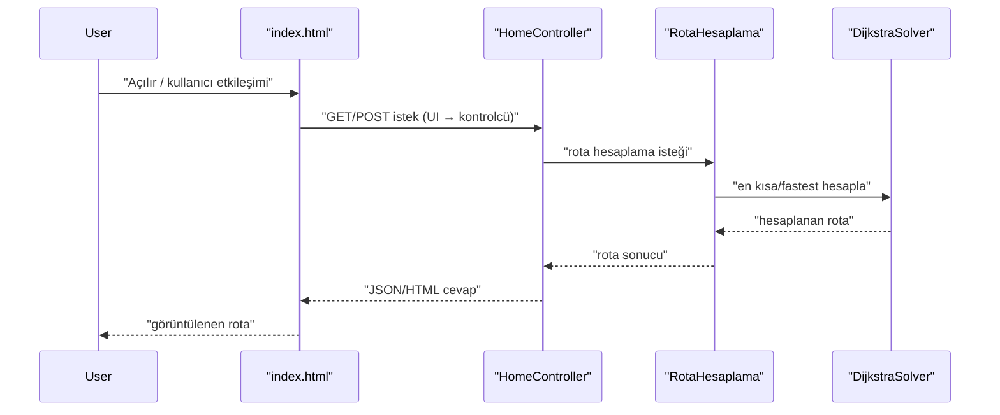

# Sistem Mimarisi: YusuffBulbul/Izmit_sehir_ici_ulasim

> Mimari analiz ve code review
>
> 2026-09-07 tarihinde Repo-to-Blueprint Architect tarafından otomatik oluşturuldu

# Türkçe Sürüm

## Proje Amacı
Bu depo, şehir içi ulaşım rotalarını ve durak/hat verisini işleyen bir Java uygulaması içerir; dosya isimleri ve kaynaklar (ör. RotaHesaplama, DijkstraSolver, GraphBuilderService, src/main/resources/static/index.html, data.json) rota hesaplama ve durak yönetimi alanında çalıştığını gösterir.

## Teknik Yığın
- **Dil**: Java (kaynak dosyaları .java uzantılıdır; klasör: src/main/java)
- **Framework**: Pom.xml içeriği sağlanmadığı için bağımlılık dosyalarından framework bilgisine dair kanıt yok
- **Temel Bağımlılıklar**: pom.xml dosyası repository kökünde bulunuyor; içeriği belirtilmediğinden listelenebilecek bağımlılık kanıtı yok
- **Altyapı**: (ilgili konfigürasyon dosyası kanıtı yok)

## Mimari Plan

## İstek Akışı

## Kanıta Dayalı Riskler
1. Kaynak kodda web kontrolcüleri (HomeController.java, StopController.java) ve statik UI (src/main/resources/static/index.html) bulunması, ancak repository kökünde kimlik doğrulama/authorization konfigürasyonuna dair dosya adı kanıtı olmaması — yetkilendirme/kimlik doğrulama eksikliği riski (HomeController.java, StopController.java, src/main/resources/static/index.html).
2. Veri kaynağı olarak uygulama içi JSON (src/main/resources/data.json) ve ManualGraph/GraphBuilderService sınıfları olması, dışa taşınan bir veritabanı kullanılmadığına dair işaret — ölçeklenebilirlik ve veri yönetimi sınırlamaları (src/main/resources/data.json, src/main/java/com/example/ManualGraph.java, src/main/java/com/example/GraphBuilderService.java).
3. Test klasöründe yalnızca tek bir test sınıfı bulunması (src/test/java/com/example/AppTest.java) — sınırlı test kapsaması, regresyon ve güvenilirlik riski.

## Code Review

### Öncelik Özeti
| ID | Öncelik | Kategori | Teknik Borç | Kanıt | Etki | Önerilen Aksiyon |
|---|---:|---|---|---|---|---|
| [SEC-01] | P1 | Güvenlik | Kimlik doğrulama/authorization eksikliği | src/main/java/com/example/HomeController.java, src/main/java/com/example/StopController.java, src/main/resources/static/index.html (kontrolcüler + UI var; repo kökünde auth/config adlarına dair dosya yok) | İstemci isteklerinin yetkisiz erişime açık olma riski | Denetim: endpointleri listele; gerekli ise Spring Security veya uygun auth katmanı ekleyin; hassas operasyonlar için yetkilendirme kontrolü uygulayın |
| [STA-02] | P2 | Statik Analiz | Zayıf birim testi kapsamı | src/test/java/com/example/AppTest.java (tek test sınıfı gözlemlendi) | Regresyon riski, düşük güven | Test kapsamını genişletin: rota hesaplama, GraphBuilderService, DijkstraSolver ve Controller katmanları için birim ve entegrasyon testleri ekleyin |
| [ARC-03] | P2 | Mimari | Tek paket ve monolitik kaynak düzeni | src/main/java/com/example/* (çoğu sınıf com/example paketinde) | Sınıflar arası sıkı bağımlılık, modülerlik zorluğu | Paketleme: domain, controller, service, algorithm, model gibi alt paketlere ayırın; bağımlılık sınırları oluşturun |
| [TEC-04] | P2 | Teknoloji | Gömülü JSON veri deposu kullanımı | src/main/resources/data.json, src/main/java/com/example/ManualGraph.java, src/main/java/com/example/GraphBuilderService.java | Veri büyüdükçe ölçeklenme ve eşzamanlı erişim sorunları | Veri erişimini soyutlayın; gerektiğinde ilişkisel veya NoSQL bir veri kaynağına taşıma planı hazırlayın; I/O eşzamanlılığı ve güncelleme stratejisini tanımlayın |
| [TEC-05] | P3 | Teknoloji | Dokümantasyon: ana README yok (sadece README_ARCH.md) | README_ARCH.md mevcut; repository kökünde README.md yok | Yeni katkı sağlayanlar için onboarding sürtüşmesi | Kısa README.md ekleyin: proje başlatma, build, test komutları ve mimari hızlı özet |

### Statik Analiz
- [P2] STA-02: src/test/java/com/example/AppTest.java dosyasının tek test sınıfı olması, birim ve entegrasyon testi eksikliği gösteriyor. Öneri: DijkstraSolver, RotaHesaplama, GraphBuilderService ve controller metodları için kapsamlı testler ekleyin.

### Güvenlik
- [P1] SEC-01: Web katmanını temsil eden src/main/java/com/example/HomeController.java ve src/main/java/com/example/StopController.java ile birlikte bir statik UI (src/main/resources/static/index.html) bulunuyor; repositoryde kimlik doğrulama/authorization yapılandırma veya güvenlik sınıfı adlarına dair kanıt bulunmuyor. Öneri: Endpoint erişim kontrolü ve kimlik doğrulama eklenip doğrulanmalı.

### Mimari
- [P2] ARC-03: Tüm kaynakların tek paket altında (src/main/java/com/example) toplandığı görülüyor; bu, sorumlulukların ve sınırların belirgin olmamasına yol açabilir. Öneri: controller, service, model, algorithm gibi alt paketlere yeniden düzenleme yapılmalı.

### Teknoloji
- [P2] TEC-04: Veri kaynağı olarak src/main/resources/data.json kullanımı ve ManualGraph/GraphBuilderService sınıfları veri yönetiminin uygulama içinde tutulduğunu gösteriyor; ölçeklenebilirlik ve veri tutarlılığı sorunlarına yol açabilir. Öneri: Veri erişim katmanı soyutlanarak dışa taşınabilir veri mağazalarına geçiş planı hazırlansın.
- [P3] TEC-05: README_ARCH.md var, ancak proje kökünde kullanıcıları hızlı başlatacak README.md eksik. Öneri: Temel README.md ekleyin.

---

## Depo İstatistikleri
| Metrik | Değer |
|---|---|
| Toplam Dosya | 42 |
| Toplam Dizin | 11 |
| Oluşturulma | 2026-09-07 |
| Kaynak | [YusuffBulbul/Izmit_sehir_ici_ulasim](https://github.com/YusuffBulbul/Izmit_sehir_ici_ulasim) |

---

*Repo-to-Blueprint Architect via n8n*
